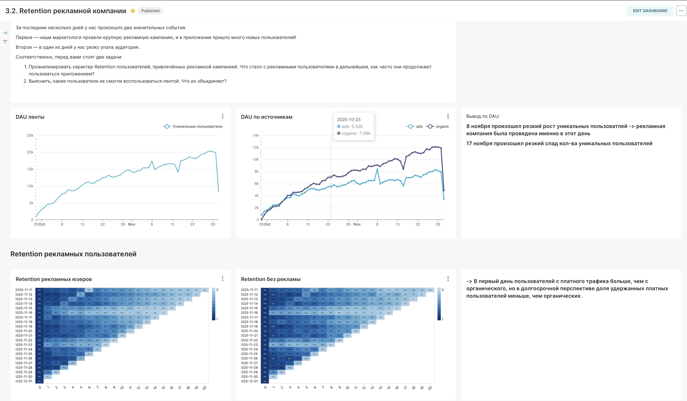
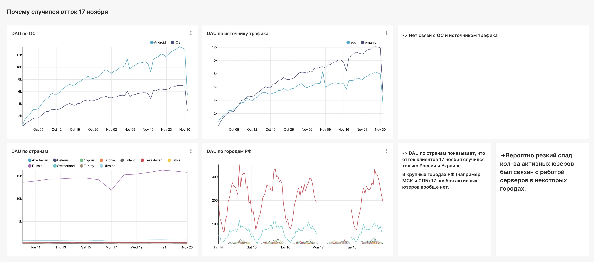

# Superset (STAR): Retention рекламной кампании + расследование падения DAU

## S — Situation (ситуация)
После запуска крупной рекламной кампании в продукте произошли два заметных события:
1) резкий рост аудитории в день кампании,
2) резкое падение аудитории в один из дней позже.

Нужно было понять, что произошло с retention рекламных пользователей и есть ли признаки продуктовой/технической проблемы в день падения.

## Задача
1) Оценить влияние кампании на **DAU** и долю платного/органического трафика.  
2) Сравнить **retention рекламных пользователей vs органики**.  
3) Провести первичную диагностику **падения DAU** через сегментации и сформулировать гипотезу причины + что проверять дальше.

## Что я сделала:
### 1) Проверила динамику DAU и источники
- Построила **DAU ленты** по времени, чтобы увидеть эффект кампании и день падения.
- Разложила **DAU по источникам** (ads vs organic), чтобы отделить вклад рекламы от органического трафика.

### 2) Построила и сравнила retention по когортам
- Сформировала когорты пользователей и построила heatmap retention:
  - **Retention рекламных пользователей**
  - **Retention органических пользователей**

### 3) Диагностика падения DAU
Чтобы понять, “кто именно пропал” в день падения, проверила сегментации:
- по **ОС** (Android/iOS),
- по **источнику трафика** (ads/organic),
- по **географии/городам**.

## Результат и вывод:
**Про кампанию:**
- В день запуска кампании — заметный рост DAU за счёт платного трафика.
- В долгосрочной перспективе **retention у рекламных пользователей ниже, чем у органики** → платный трафик даёт рост “в моменте”, но удерживается хуже.

**Про падение DAU:**
- Падение не объясняется ОС или источником трафика.
- Гео-сегментация указывает на локальность проблемы → **гипотеза: сбой/доступность серверов в части городов/регионов**.

## Артефакты (скрины из Superset)
### 1) Retention рекламы vs органика + динамика DAU

### 2) Диагностика падения аудитории (сегментации)

## Что бы сделала дальше 
- Проверила техметрики/логи в день падения: ошибки, таймауты, latency, статусы релизов
- Поставила мониторинги/алерты: резкие изменения DAU, доля ошибок, падение в ключевых сегментах
- Досегментировала: версия приложения, провайдер/сеть, конкретные города

## Инструменты
Superset, DAU, cohorts/retention, сегментации (OS/source/geo), диагностика аномалий
