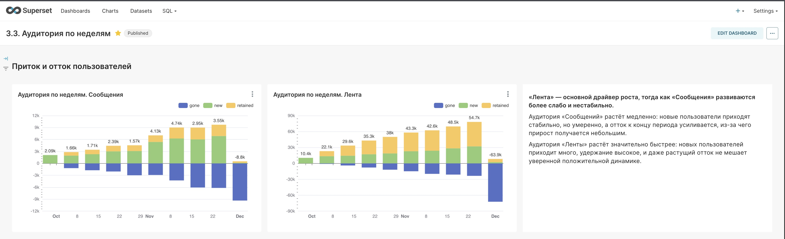

# Superset: Аудитория по неделям (new / retained / gone)

  ## Ситуация
Нужно было понять динамику аудитории по неделям и сравнить два направления продукта: «Лента» и «Сообщения».

## Задача
- Построить weekly-разрез с разложением аудитории на new/retained/gone
- Сравнить стабильность роста и вклад удержания по двум направлениям
- Сформулировать выводы и что проверять дальше

## Действия
- Собрала недельные столбики new/retained/gone отдельно для «Ленты» и «Сообщений»
- Сравнила тренд прироста и рост/усиление оттока к концу периода

## Результат
- «Лента» — основной драйвер роста: много новых пользователей, удержание выше и динамика более уверенная
- «Сообщения» растут слабее и нестабильнее: отток усиливается к концу периода, из-за чего прирост небольшой

## Скрин

## Инструменты
Superset, product metrics, retention/churn
